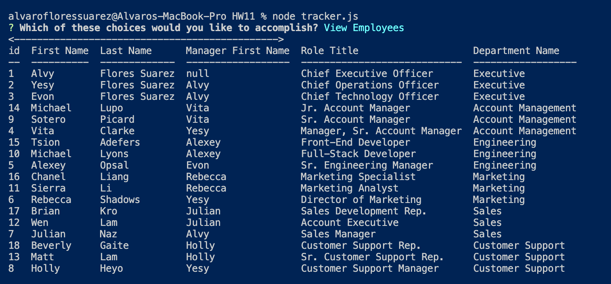
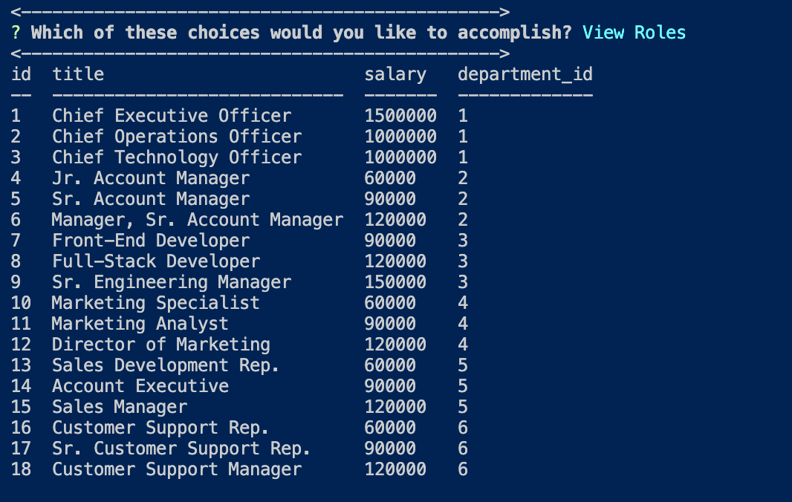
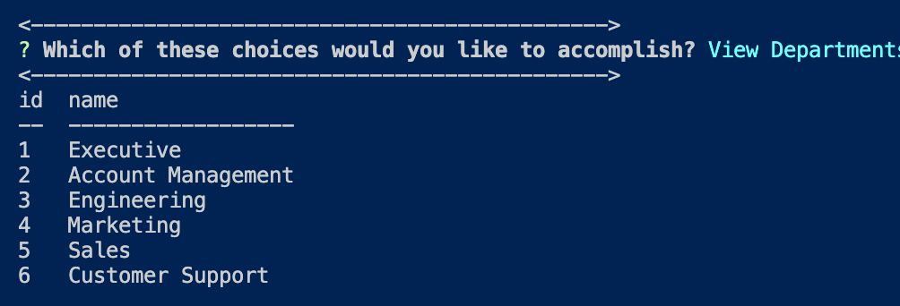
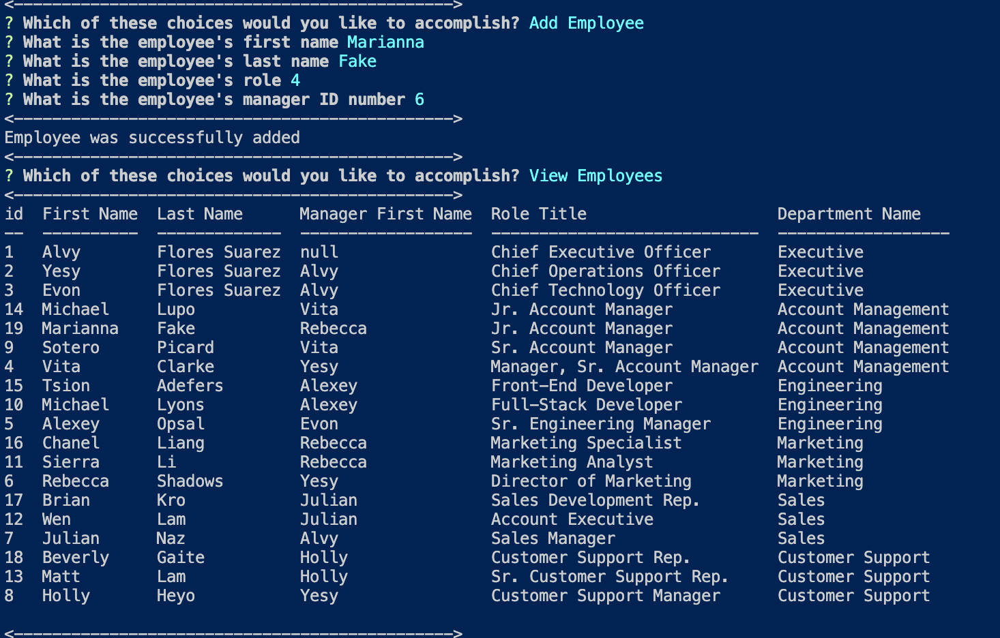
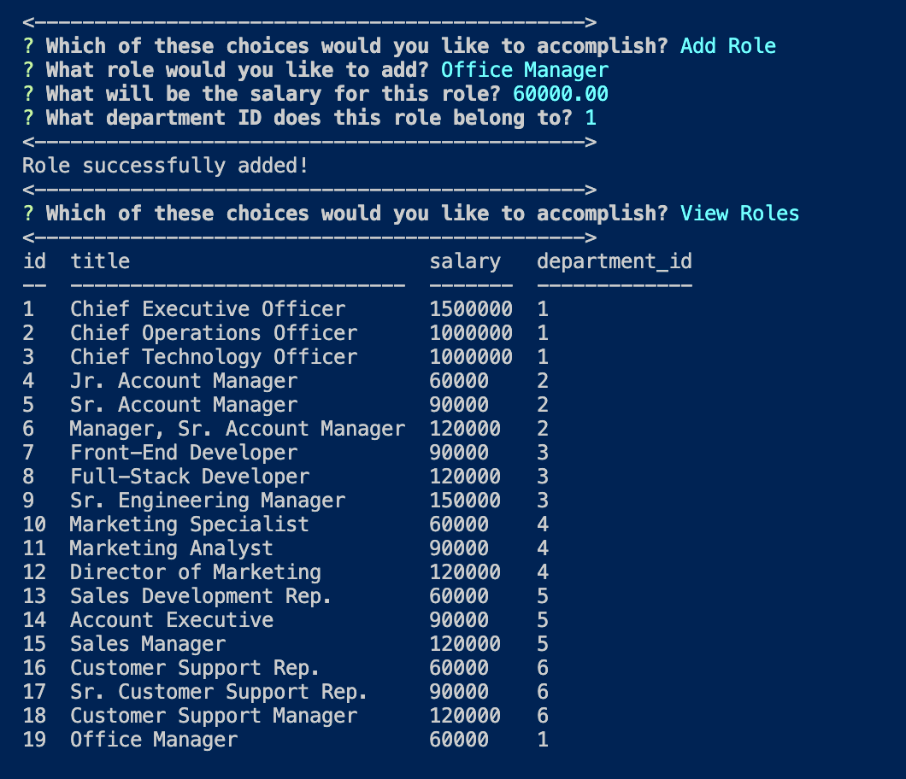
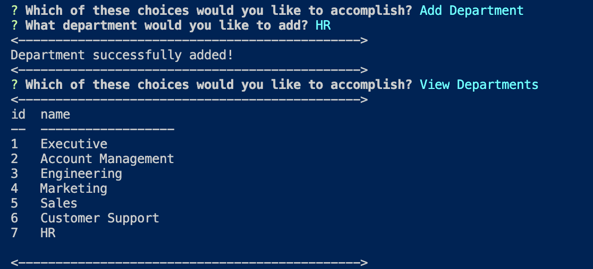
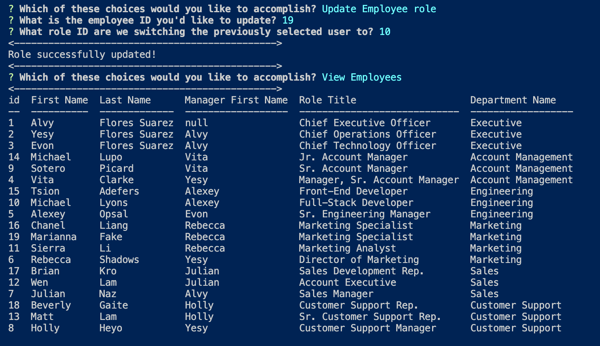

# Team Tracker

## Description:
This repository provides the landing page for my team tracker. Through this CLI you will be able to view and manage the departments, roles, and employees in my company.

Please click the link here to access my [repository](https://github.com/floressuarezalvaro/employee_tracker). Below is a video of how my team generator works. Due to the length of my gif, I was not able to make the dimensions larger so I have included screenshots of each section below.

## Employee Tracker Video:

## View Employees:

## View Roles:

## View Department:

## Add and then view employee:

## Add and then view roles:

## Add and then view department:

## Update employee role and then view employees:

## Installation:
To install the dependencies, please run the following command:

nmp install

## Contributing:
To contribute you can [build from the source itself](https://github.com/floressuarezalvaro/employee_tracker/wiki).

## Questions:
The best way to get a hold of me via email, at floressuarezalvaro@gmail.com. You can also [submit a bug](https://github.com/floressuarezalvaro/employee_tracker/issues), or you can review the [source code](https://github.com/floressuarezalvaro/employee_tracker/pulls) changes. 

## MIT License

Copyright (c) [2020] [Alvaro Flores Suarez]

Permission is hereby granted, free of charge, to any person obtaining a copy
of this software and associated documentation files (the "Software"), to deal
in the Software without restriction, including without limitation the rights
to use, copy, modify, merge, publish, distribute, sublicense, and/or sell
copies of the Software, and to permit persons to whom the Software is
furnished to do so, subject to the following conditions:

The above copyright notice and this permission notice shall be included in all
copies or substantial portions of the Software.

THE SOFTWARE IS PROVIDED "AS IS", WITHOUT WARRANTY OF ANY KIND, EXPRESS OR
IMPLIED, INCLUDING BUT NOT LIMITED TO THE WARRANTIES OF MERCHANTABILITY,
FITNESS FOR A PARTICULAR PURPOSE AND NONINFRINGEMENT. IN NO EVENT SHALL THE
AUTHORS OR COPYRIGHT HOLDERS BE LIABLE FOR ANY CLAIM, DAMAGES OR OTHER
LIABILITY, WHETHER IN AN ACTION OF CONTRACT, TORT OR OTHERWISE, ARISING FROM,
OUT OF OR IN CONNECTION WITH THE SOFTWARE OR THE USE OR OTHER DEALINGS IN THE
SOFTWARE.